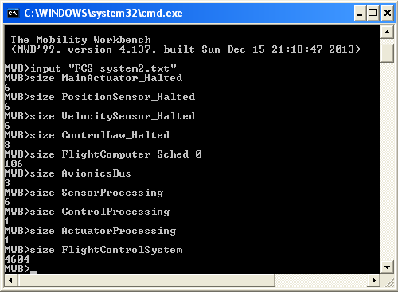
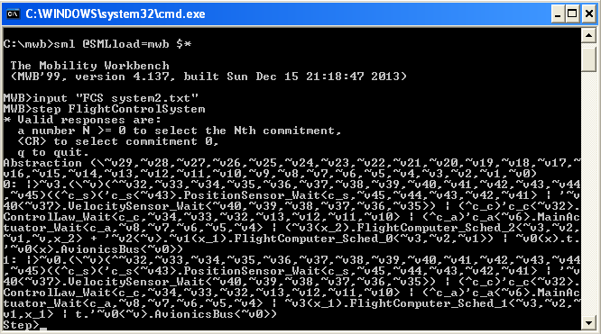
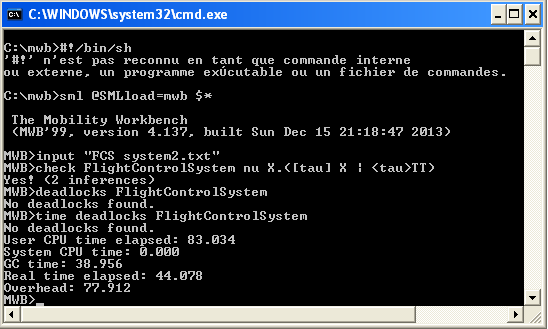
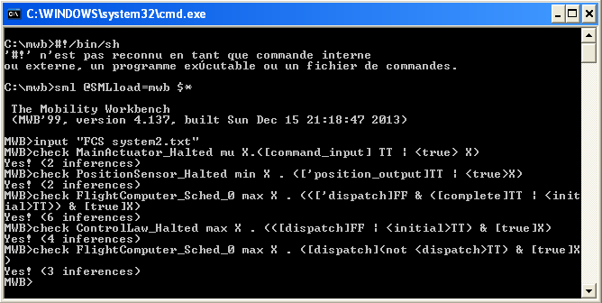

# I. Appendices of the paper Mapping AADL into $\pi$-calculus for Formal Verification of Complex Architectures

## A. Flight Control System AADL Specification

```aadl
package FlightControlSystem
public
  -- Data Type Definitions
  data Position
  end Position;

  data Velocity
  end Velocity;

  data ControlCommand
  end ControlCommand;

  -- Processor and Bus Definitions
  processor FlightComputer
  end FlightComputer;

  bus AvionicsBus
  end AvionicsBus;

  -- Sensor Thread Definitions
  thread PositionSensorThread
  features
    position_output: out data port Position;
    sensor_status: out event port;  -- Event port for sensor status
  end PositionSensorThread;

  thread VelocitySensorThread
  features
    velocity_output: out data port Velocity;
    thrust_adjustment: out event data port Velocity;  -- New event-data port for dynamic thrust adjustments
  end VelocitySensorThread;

  -- Control Thread Definitions
  thread ControlLawThread
  features
    position_input: in data port Position;
    velocity_input: in data port Velocity;
    thrust_input: in event data port Velocity;  -- Receiving thrust adjustment data
    control_output: out data port ControlCommand;
  end ControlLawThread;

  -- Actuator Thread Definition
  thread MainActuatorThread
  features
    command_input: in data port ControlCommand;
    activation: in event port;
  end MainActuatorThread;

  -- Process Implementations
  process SensorProcessing
  features
    position_data: out data port Position;
    velocity_data: out data port Velocity;
    sensor_status: out event port;
    thrust_adjustment: out event data port Velocity;
  end SensorProcessing;

  process implementation SensorProcessing.Impl
  subcomponents
    position_sensor: thread PositionSensorThread;
    velocity_sensor: thread VelocitySensorThread;
  connections
    position_connection: port position_sensor.position_output -> position_data;
    velocity_connection: port velocity_sensor.velocity_output -> velocity_data;
    status_connection: port position_sensor.sensor_status -> sensor_status;
    thrust_connection: port velocity_sensor.thrust_adjustment -> thrust_adjustment;
  end SensorProcessing.Impl;

  process ControlProcessing
  features
    position_input: in data port Position;
    velocity_input: in data port Velocity;
    thrust_input: in event data port Velocity;
    control_command: out data port ControlCommand;
  end ControlProcessing;

  process implementation ControlProcessing.Impl
  subcomponents
    control_law: thread ControlLawThread;
  connections
    position_connection: port position_input -> control_law.position_input;
    velocity_connection: port velocity_input -> control_law.velocity_input;
    thrust_connection: port thrust_input -> control_law.thrust_input;
    control_connection: port control_law.control_output -> control_command;
  end ControlProcessing.Impl;

  process ActuatorProcessing
  features
    command_input: in data port ControlCommand;
    activation: in event port;
  end ActuatorProcessing;

  process implementation ActuatorProcessing.Impl
  subcomponents
    main_actuator: thread MainActuatorThread;
  connections
    command_connection: port command_input -> main_actuator.command_input;
    activation_connection: port activation -> main_actuator.activation;
  end ActuatorProcessing.Impl;

  -- Top-Level System
  system FlightControlSystem
  end FlightControlSystem;

  system implementation FlightControlSystem.Impl
  subcomponents
    sensor_process: process SensorProcessing.Impl;
    control_process: process ControlProcessing.Impl;
    actuator_process: process ActuatorProcessing.Impl;
    flight_computer: processor FlightComputer;
    avionics_bus: bus AvionicsBus;
  connections
    sensor_to_control_position: port sensor_process.position_data -> control_process.position_input;
    sensor_to_control_velocity: port sensor_process.velocity_data -> control_process.velocity_input;
    sensor_to_control_thrust: port sensor_process.thrust_adjustment -> control_process.thrust_input;
    control_to_actuator: port control_process.control_command -> actuator_process.command_input;
    sensor_status_to_actuator: port sensor_process.sensor_status -> actuator_process.activation;
    
  properties
    Actual_Processor_Binding => (reference(flight_computer)) applies to sensor_process;
    Actual_Processor_Binding => (reference(flight_computer)) applies to control_process;
    Actual_Processor_Binding => (reference(flight_computer)) applies to actuator_process;
    Actual_Connection_Binding => (reference(avionics_bus)) applies to sensor_to_control_position;
    Actual_Connection_Binding => (reference(avionics_bus)) applies to sensor_to_control_velocity;
    Actual_Connection_Binding => (reference(avionics_bus)) applies to sensor_to_control_thrust;
    Actual_Connection_Binding => (reference(avionics_bus)) applies to control_to_actuator;
    Actual_Connection_Binding => (reference(avionics_bus)) applies to sensor_status_to_actuator;
  end FlightControlSystem.Impl;

end FlightControlSystem;
```
## B. The full π-calculus Code Generated in MWB Format

Some textual representations of the π-calculus are adapted in MWB as follows: the restriction ν as ^, the output action x̄ as 'x, the internal action τ as t and each process identifier expression in the MWB will start with the keyword *agent* which means process. We can import the generated π-calculus specification using the command *input file.pi*, or type the agent declarations manually. The command *env* can be used to print all the current agent declarations of an uploaded specification. Another thing, all the processes of the π-calculus in MWB must be closed, which means contain all the free names, so do not be surprised when you find them repeated in the processes' declarations.

```pi
agent SensorProcessing(initial, dispatch, complete, x_ps, x_vs, position_data, sensor_status, velocity_data, thrust_adjustment) = 
    PositionSensor_Halted(initial, dispatch, complete, x_ps, position_data, sensor_status) | 
    VelocitySensor_Halted(initial, dispatch, complete, x_vs, velocity_data, thrust_adjustment)

agent ControlProcessing(initial, dispatch, complete, x_cl, position_input, velocity_input, thrust_input, control_command) = 
    ControlLaw_Halted(initial, dispatch, complete, x_cl, position_input, velocity_input, thrust_input, control_command)

agent ActuatorProcessing(initial, dispatch, complete, x_ma, command_input, activation) = 
    MainActuator_Halted(initial, dispatch, complete, x_ma, command_input, activation)

agent PositionSensor_Halted(initial, dispatch, complete, x_ps, position_output, sensor_status) = 
    'initial<x_ps>.PositionSensor_Wait(initial, dispatch, complete, x_ps, position_output, sensor_status)

agent PositionSensor_Wait(initial, dispatch, complete, x_ps, position_output, sensor_status) = 
    dispatch(d).[d=x_ps]PositionSensor_Compute(initial, dispatch, complete, x_ps, position_output, sensor_status)

agent PositionSensor_Compute(initial, dispatch, complete, x_ps, position_output, sensor_status) = 
    t.(^pos)'position_output<pos>.'sensor_status.'complete<x_ps>.PositionSensor_Wait(initial, dispatch, complete, x_ps, position_output, sensor_status)

agent VelocitySensor_Halted(initial, dispatch, complete, x_vs, velocity_output, thrust_adjustment) = 
    'initial<x_vs>.VelocitySensor_Wait(initial, dispatch, complete, x_vs, velocity_output, thrust_adjustment)

agent VelocitySensor_Wait(initial, dispatch, complete, x_vs, velocity_output, thrust_adjustment) = 
    dispatch(d).[d=x_vs]VelocitySensor_Compute(initial, dispatch, complete, x_vs, velocity_output, thrust_adjustment)

agent VelocitySensor_Compute(initial, dispatch, complete, x_vs, velocity_output, thrust_adjustment) = 
    t.(^vel)'velocity_output<vel>.(^thrust_data)'thrust_adjustment<thrust_data>.'complete<x_vs>.VelocitySensor_Wait(initial, dispatch, complete, x_vs, velocity_output, thrust_adjustment)

agent ControlLaw_Halted(initial, dispatch, complete, x_cl, position_input, velocity_input, thrust_input, control_output) = 
    'initial<x_cl>.ControlLaw_Wait(initial, dispatch, complete, x_cl, position_input, velocity_input, thrust_input, control_output)

agent ControlLaw_Wait(initial, dispatch, complete, x_cl, position_input, velocity_input, thrust_input, control_output) = 
    dispatch(d).[d=x_cl]ControlLaw_Compute(initial, dispatch, complete, x_cl, position_input, velocity_input, thrust_input, control_output)

agent ControlLaw_Compute(initial, dispatch, complete, x_cl, position_input, velocity_input, thrust_input, control_output) = 
    position_input(pos).velocity_input(vel).thrust_input(thrust).t.(^cmd)'control_output<cmd>.'complete<x_cl>.ControlLaw_Wait(initial, dispatch, complete, x_cl, position_input, velocity_input, thrust_input, control_output)

agent MainActuator_Halted(initial, dispatch, complete, x_ma, command_input, activation) = 
    'initial<x_ma>.MainActuator_Wait(initial, dispatch, complete, x_ma, command_input, activation)

agent MainActuator_Wait(initial, dispatch, complete, x_ma, command_input, activation) = 
    dispatch(d).[d=x_ma]MainActuator_Compute(initial, dispatch, complete, x_ma, command_input, activation)

agent MainActuator_Compute(initial, dispatch, complete, x_ma, command_input, activation) = 
    command_input(cmd).activation.t.'complete<x_ma>.MainActuator_Wait(initial, dispatch, complete, x_ma, command_input, activation)

agent FlightComputer_Sched_0(initial, dispatch, complete) = 
    initial(x_1).FlightComputer_Sched_1(initial, dispatch, complete, x_1)

agent FlightComputer_Sched_1(initial, dispatch, complete, x_1) = 
    initial(x_2).FlightComputer_Sched_2(initial, dispatch, complete, x_1, x_2) + 
    'dispatch<x_1>.complete(x_1).FlightComputer_Sched_0(initial, dispatch, complete)

agent FlightComputer_Sched_2(initial, dispatch, complete, x_1, x_2) = 
    initial(x_3).FlightComputer_Sched_3(initial, dispatch, complete, x_1, x_2, x_3) + 
    'dispatch<x_1>.complete(x_1).FlightComputer_Sched_1(initial, dispatch, complete, x_2)

agent FlightComputer_Sched_3(initial, dispatch, complete, x_1, x_2, x_3) = 
    initial(x_4).FlightComputer_Sched_4(initial, dispatch, complete, x_1, x_2, x_3, x_4) + 
    'dispatch<x_1>.complete(x_1).FlightComputer_Sched_2(initial, dispatch, complete, x_2, x_3)

agent FlightComputer_Sched_4(initial, dispatch, complete, x_1, x_2, x_3, x_4) = 
    'dispatch<x_1>.complete(x_1).FlightComputer_Sched_3(initial, dispatch, complete, x_2, x_3, x_4)

agent AvionicsBus(c) = c(x).t.'c<x>.AvionicsBus(c)

agent FlightControlSystem = (^c, position_output, velocity_output, sensor_status, thrust_adjustment, 
    position_input, velocity_input, thrust_input, control_output, command_input, control_command, activation, 
    initial, dispatch, complete, x_ps, x_vs, x_cl, x_ma)(
    SensorProcessing(initial, dispatch, complete, x_ps, x_vs, position_input, activation, velocity_input, thrust_input) | 
    ControlProcessing(initial, dispatch, complete, x_cl, position_input, velocity_input, thrust_input, command_input) | 
    ActuatorProcessing(initial, dispatch, complete, x_ma, command_input, activation) | 
    FlightComputer_Sched_0(initial, dispatch, complete) | 
    AvionicsBus(c)
)
```

## C. Analysis and Verification Proofs

Here, we present different analysis and verification tasks performed using the MWB tool.

**Size of processes** (c.f. Figure below)



*Figure: Size of processes*

**Simulation** (c.f. Figure below)



*Figure: Simulation of the main process*

**Deadlock Freedom** (c.f. Figure below)



*Figure: Deadlock details*

For the deadlock property, and because of the problem of state explosion in MWB verification tool, we have simplified the pi-calculus code generated by eliminating the match expressions. This allows thread processes to not synchonize on matching tests which helps reducing the state space and checking the property, otherwise the tool continues to execute without returning any results and sometimes finishes the execution surprisingly (i.e. it can't handle the generation of the complete state space). The rest of the properties were valid for both versions. The slightely changed version is given as follows:

```mwb
agent SensorProcessing(initial, dispatch, complete, x_ps, x_vs, position_data, sensor_status, velocity_data, thrust_adjustment) = 
    PositionSensor_Halted(initial, dispatch, complete, x_ps, position_data, sensor_status) | 
    VelocitySensor_Halted(initial, dispatch, complete, x_vs, velocity_data, thrust_adjustment)

agent ControlProcessing(initial, dispatch, complete, x_cl, position_input, velocity_input, thrust_input, control_command) = 
    ControlLaw_Halted(initial, dispatch, complete, x_cl, position_input, velocity_input, thrust_input, control_command)

agent ActuatorProcessing(initial, dispatch, complete, x_ma, command_input, activation) = 
    MainActuator_Halted(initial, dispatch, complete, x_ma, command_input, activation)

agent PositionSensor_Halted(initial, dispatch, complete, x_ps, position_output, sensor_status) = 
    'initial<x_ps>.PositionSensor_Wait(initial, dispatch, complete, x_ps, position_output, sensor_status)

agent PositionSensor_Wait(initial, dispatch, complete, x_ps, position_output, sensor_status) = 
    dispatch(d).PositionSensor_Compute(initial, dispatch, complete, x_ps, position_output, sensor_status)

agent PositionSensor_Compute(initial, dispatch, complete, x_ps, position_output, sensor_status) = 
    t.(^pos)'position_output<pos>.'sensor_status.'complete<x_ps>.PositionSensor_Halted(initial, dispatch, complete, x_ps, position_output, sensor_status)

agent VelocitySensor_Halted(initial, dispatch, complete, x_vs, velocity_output, thrust_adjustment) = 
    'initial<x_vs>.VelocitySensor_Wait(initial, dispatch, complete, x_vs, velocity_output, thrust_adjustment)

agent VelocitySensor_Wait(initial, dispatch, complete, x_vs, velocity_output, thrust_adjustment) = 
    dispatch(d).VelocitySensor_Compute(initial, dispatch, complete, x_vs, velocity_output, thrust_adjustment)

agent VelocitySensor_Compute(initial, dispatch, complete, x_vs, velocity_output, thrust_adjustment) = 
    t.(^vel)'velocity_output<vel>.(^thrust_data)'thrust_adjustment<thrust_data>.'complete<x_vs>.VelocitySensor_Halted(initial, dispatch, complete, x_vs, velocity_output, thrust_adjustment)

agent ControlLaw_Halted(initial, dispatch, complete, x_cl, position_input, velocity_input, thrust_input, control_output) = 
    'initial<x_cl>.ControlLaw_Wait(initial, dispatch, complete, x_cl, position_input, velocity_input, thrust_input, control_output)

agent ControlLaw_Wait(initial, dispatch, complete, x_cl, position_input, velocity_input, thrust_input, control_output) = 
    dispatch(d).ControlLaw_Compute(initial, dispatch, complete, x_cl, position_input, velocity_input, thrust_input, control_output)

agent ControlLaw_Compute(initial, dispatch, complete, x_cl, position_input, velocity_input, thrust_input, control_output) = 
    position_input(pos).velocity_input(vel).thrust_input(thrust).t.(^cmd)'control_output<cmd>.'complete<x_cl>.ControlLaw_Halted(initial, dispatch, complete, x_cl, position_input, velocity_input, thrust_input, control_output)

agent MainActuator_Halted(initial, dispatch, complete, x_ma, command_input, activation) = 
    'initial<x_ma>.MainActuator_Wait(initial, dispatch, complete, x_ma, command_input, activation)

agent MainActuator_Wait(initial, dispatch, complete, x_ma, command_input, activation) = 
    dispatch(d).MainActuator_Compute(initial, dispatch, complete, x_ma, command_input, activation)

agent MainActuator_Compute(initial, dispatch, complete, x_ma, command_input, activation) = 
    command_input(cmd).activation.t.'complete<x_ma>.MainActuator_Halted(initial, dispatch, complete, x_ma, command_input, activation)

agent FlightComputer_Sched_0(initial, dispatch, complete) = initial(y1).initial(y2).initial(y3).initial(y4).FlightComputer_Dispatch(initial, dispatch, complete, y1, y2, y3, y4)

agent FlightComputer_Dispatch(initial, dispatch, complete, y1, y2, y3, y4) = 'dispatch<y1>.'dispatch<y2>.'dispatch<y3>.'dispatch<y4>.FlightComputer_Collect(initial, dispatch, complete, y1, y2, y3, y4)

agent FlightComputer_Collect(initial, dispatch, complete, y1, y2, y3, y4) =   complete(r1).complete(r2).complete(r3).complete(r4).FlightComputer_Sched_0(initial, dispatch, complete)

agent AvionicsBus(c) = c(x).t.'c<x>.AvionicsBus(c)

agent FlightControlSystem = (^c, position_output, velocity_output, sensor_status, thrust_adjustment, 
    position_input, velocity_input, thrust_input, control_output, command_input, control_command, activation, 
    initial, dispatch, complete, x_ps, x_vs, x_cl, x_ma)(
    SensorProcessing(initial, dispatch, complete, x_ps, x_vs, position_input, activation, velocity_input, thrust_input) | 
    ControlProcessing(initial, dispatch, complete, x_cl, position_input, velocity_input, thrust_input, command_input) | 
    ActuatorProcessing(initial, dispatch, complete, x_ma, command_input, activation) | 
    FlightComputer_Sched_0(initial, dispatch, complete) | 
    AvionicsBus(c)
)
```
**Liveness, Schedulability, Mutual Exclusion** (c.f. Figure below)



*Figure: Liveness, Schedulability, Mutual Exclusion*

---
**equivalence checking**


---

# II. AADL to $\pi$-Calculus Model Transformation Tool

This repository explains with details the developed automated model-driven toolchain, used to bridge the gap between architectural modeling in **AADL** and formal verification in **$\pi$-Calculus**. The tool automates the mapping rules defined in our approach to facilitate the formal analysis of real-time embedded systems. The figure bellow illustrates the entire outline of the project.


---

## 1) Repository Structure

* **`plugins/`**: Contains the pre-compiled `.jar` files for immediate deployment into OSATE.
    * `fr.mem4csd.aadl2picalculus.acceleo.pi.jar` (Core Transformation Logic)
    * `fr.mem4csd.aadl2picalculus.ui.jar` (UI/Menu integration)
* **`src/`**: Contains the Eclipse/OSATE projects for developers to import and build:
    * `fr.mem4csd.aadl2picalculus.acceleo.pi`: Core Acceleo transformation project (.mtl templates).
    * `fr.mem4csd.aadl2picalculus.ui`: UI integration for the OSATE context menu.
* **`sampleAADLProjects/`**: A set of sample AADL projects (including `.aadl` and `.aaxl2` files) used for benchmarking and validation.

---

## 2) Project Workflow: From AADL to π‑Calculus Verification

The verification workflow consists of three main stages: (1) modeling the system architecture in AADL using OSATE, (2) automatically translating the AADL model to π‑calculus using a custom plugin, and (3) verifying temporal properties using the Mobility Workbench (MWB).

---

### Stage 1: AADL Modeling in OSATE

The system architecture is first modeled using the Architecture Analysis and Design Language (AADL) within the OSATE (Open Source AADL Tool Environment) platform. The model captures:

- **Threads** – Periodic tasks with timing properties (period, deadline, WCET).
- **Ports** – Data ports for regular sensor streams, event ports for status signals, and event‑data ports for urgent adjustments.
- **Processors and Buses** – Execution resources and communication channels.
- **Bindings** – Mapping of software components to hardware resources.

**Screenshot: AADL Model in OSATE**


The example above shows the `FlightControlSystem` package with sensor threads (`PositionSensorThread`, `VelocitySensorThread`), a control law thread (`ControlLawThread`), and their associated ports.

---

### Stage 2: Automatic Translation to π‑Calculus

A custom OSATE plugin (`Convert AADL to Pi‑Calculus`) automatically translates the AADL model into a π‑calculus specification. The translation maps:

| AADL Concept | π‑Calculus Equivalent |
|--------------|----------------------|
| Periodic thread | Agent with `Halted → Wait → Compute` states |
| Data port | Channel name (e.g., `position_output`) |
| Event port | Channel without data (e.g., `sensor_status`) |
| Processor | Scheduler agent (`FlightComputer_Sched_0`) |
| Bus | Bus agent (e.g., `AvionicsBus`) |
| Dispatch protocol | `'initial`, `'dispatch`, `'complete` handshake |

**Screenshot: Plugin Trigger in OSATE**


Right‑clicking on the AADL system implementation invokes the translation plugin, which generates a `.pi` file containing the π‑calculus agents.

**Screenshot: Generated π‑Calculus Code**


The generated code includes agents for each thread (e.g., `PositionSensor_Halted`, `ControlLaw_Compute`), the scheduler (`FlightComputer_Sched_0`), and the avionics bus (`AvionicsBus`).

---

### Stage 3: Temporal Logic Verification in MWB

The generated π‑calculus file is loaded into the Mobility Workbench (MWB), where modal μ‑calculus formulas are used to verify:

- **Deadlock freedom** – The system never reaches a state with no outgoing transitions.
- **Safety** – No unexpected `error` labels occur.
- **Liveness** – Tasks eventually complete and messages are delivered.
- **Schedulability** – Tasks meet their bounded execution time.
- Other Functional Properties Specific to the Model.

Example MWB check for global deadlock freedom:

```mwb
check FlightControlSystemImplInstance nu X. (<true> TT & [true] X)
```
The verification results confirm that the translated model preserves the intended concurrency and communication semantics of the original AADL specification.

### Workflow Summary Diagram:

```text
┌─────────────────┐     ┌──────────────────┐     ┌────────────────────┐
│   AADL Model    │ ──► │  π‑Calculus Code │ ──► │  MWB Verification  │
│   (OSATE)       │     │  (Generated .pi) │     │  (Yes/No + Trace)  │
└─────────────────┘     └──────────────────┘     └────────────────────┘
        │                         │                        │
        ▼                         ▼                        ▼
  System architecture      Formal process model      Temporal properties
  Threads, ports, buses    Agents, channels          Deadlock, liveness
```

This workflow enables rigorous formal verification of real‑time embedded architectures by bridging the gap between industrial modeling standards (AADL) and process algebraic verification tools (π‑calculus + MWB).

## 3) Installation & Usage

### a. For End Users (Immediate Use)
If you simply want to perform transformations within OSATE, you do not need to build the source code.

1.  Navigate to the `plugins/` folder in this repository.
2.  Download the JAR files.
3.  Copy these files into the `plugins/` directory of your **OSATE installation**.
4.  Restart OSATE with the `-clean` flag to refresh the configuration.
5.  **Right-click** any **AADL Instance file (`.aaxl2`)** and select **"Convert AADL to Pi-Calculus"**.

### b. For Developers (Building from Source)
To explore or modify the mapping rules:

1.  **Import Projects**: Import all projects from the `src/` folder into your OSATE workspace.
2.  **Prerequisites**: Ensure you have the **Acceleo** engine installed in your environment.
3.  **Edit Mapping**: Open `generate.mtl` in the `fr.mem4csd.aadl2picalculus.acceleo.pi` project to edit the transformation rules.
4.  **Re-build the Logic**: After changing the `.mtl` file, you must update the plugin:
5.  **Sync Distribution**: To make your changes available to others, you must update the repository's top-level **`plugins/`** folder:
    * Export the `fr.mem4csd.aadl2picalculus.acceleo.pi` projects as **Deployable Plug-ins**.
    * Copy the newly generated JAR into the repository's **`plugins/`** folder.
6.  **Test**: Launch a **Runtime Instance** of Eclipse to test your changes live.

---

## 4) Validation with Benchmarks

The `sampleAADLProjects/` folder includes a variety of AADL models that represent common embedded real‑time architectural patterns. These models serve as benchmarks to ensure that the generated π‑calculus specifications accurately capture the concurrency, communication, and scheduling semantics of the source architecture. Each model is systematically verified using temporal logic (modal μ‑calculus) in the Mobility Workbench, checking for deadlock freedom, safety, liveness, and schedulability properties.

---

## 1) RMA Model – Rate‑Monotonic Scheduling ([Source](https://github.com/OpenAADL/AADLib/tree/master/examples/rma))

### a. Model Explanation

This AADL model illustrates a classic Rate‑Monotonic Scheduling (RMA) system running on a single processor. RMA is a fixed‑priority scheduling policy where tasks with shorter periods get higher priorities an optimal priority assignment for independent periodic tasks under preemptive scheduling.

This model captures a two‑task Rate‑Monotonic Scheduling (RMA) system executing on a single processor. Task1 has a period of 1000 ms and lower priority; Task2 has a period of 500 ms and higher priority. Both tasks autonomously release a single job at initialization, wait for dispatch from a centralized FIFO scheduler, execute for one discrete time tick (`t`), and signal completion. The scheduler maintains a bounded queue of length two. The model represents one hyperperiod—after both tasks execute once, the system reaches a quiescent termination state.

### b. AADL Code

```aadl
--  This AADL model illustrates how to conduct schedulability analysis
--  using Cheddar, and then code generation of periodic tasks.
--
--  Two periodic tasks run in parallel, without interaction. Tasks
--  parameters allows RMA analysis

package RMAAadl
public
  with Processors;

  -----------------
  -- Subprograms --
  -----------------

  subprogram Hello_Spg_1
  properties
    source_language => (C);
    source_name     => "user_hello_spg_1";
    source_text     => ("hello.c");
  end Hello_Spg_1;

  subprogram Hello_Spg_2
  properties
    source_language => (C);
    source_name     => "user_hello_spg_2";
    source_text     => ("hello.c");
  end Hello_Spg_2;

  -------------
  -- Threads --
  -------------

  thread Task
  end Task;

  thread implementation Task.impl_1
  calls
    Mycalls: {
    P_Spg : subprogram Hello_Spg_1;
    };
  properties
    Dispatch_Protocol                  => Periodic;
    Priority                           => 1;
    Period                             => 1000 ms;
    Compute_Execution_time             => 0 ms .. 3 ms;
    Deadline                           => 1000 ms;
  end Task.impl_1;

  thread implementation Task.impl_2
  calls
    Mycalls: {
    P_Spg : subprogram Hello_Spg_2;
    };
  properties
    Dispatch_Protocol                  => Periodic;
    Priority                           => 2;
    Period                             => 500 ms;
    Compute_Execution_time             => 0 ms .. 5 ms;
    Deadline                           => 500 ms;
  end Task.impl_2;

  ---------------
  -- Processor --
  ---------------

  processor cpu extends processors::cpu_rma
  end cpu;

  processor implementation cpu.impl extends processors::cpu_rma.impl
  properties
    Scheduling_Protocol => (POSIX_1003_HIGHEST_PRIORITY_FIRST_PROTOCOL);
  end cpu.impl;

  ---------------
  -- Processes --
  ---------------

  process node_a
  end node_a;

  process implementation node_a.impl
  subcomponents
    Task1 : thread Task.impl_1;
    Task2 : thread Task.impl_2;
  end node_a.impl;

  ------------
  -- System --
  ------------

  system rma
  end rma;

  system implementation rma.impl
  subcomponents
    node_a : process node_a.impl;
    cpu	   : processor cpu.impl;
  properties
    Actual_Processor_Binding => (reference (cpu)) applies to node_a;

  annex real_specification {**

     theorem check_scheduling
      foreach e in system_set do
      requires(check_scheduling);
      check(1=1);
      end check_scheduling;

      theorem check_wcrt
      foreach s in local_set do
      requires(wcrt);
      check(1=1);
      end check_wcrt;

    **};

  end rma.impl;

end RMAAadl;

```

### c. Pi Calculus expression

```pi
agent NodeA(initial, dispatch, complete, x_1, x_2) = Task1_Halted(initial, dispatch, complete, x_1) | Task2_Halted(initial, dispatch, complete, x_2)

agent Task1_Halted(initial, dispatch, complete, x_1) = 'initial<x_1>.Task1_Wait(initial, dispatch, complete, x_1)
agent Task1_Wait(initial, dispatch, complete, x_1) = dispatch(d).[d=x_1]Task1_Compute(initial, dispatch, complete, x_1)
agent Task1_Compute(initial, dispatch, complete, x_1) = t.'complete<x_1>.Task1_Wait(initial, dispatch, complete, x_1)

agent Task2_Halted(initial, dispatch, complete, x_2) = 'initial<x_2>.Task2_Wait(initial, dispatch, complete, x_2)
agent Task2_Wait(initial, dispatch, complete, x_2) = dispatch(d).[d=x_2]Task2_Compute(initial, dispatch, complete, x_2)
agent Task2_Compute(initial, dispatch, complete, x_2) = t.'complete<x_2>.Task2_Wait(initial, dispatch, complete, x_2)

agent Cpu_Sched_0(initial, dispatch, complete) = initial(y_1).Cpu_Sched_1(initial, dispatch, complete, y_1) 
agent Cpu_Sched_1(initial, dispatch, complete, y_1) = initial(y_2).Cpu_Sched_2(initial, dispatch, complete, y_1, y_2) + 'dispatch<y_1>.complete(y_1).Cpu_Sched_0(initial, dispatch, complete)
agent Cpu_Sched_2(initial, dispatch, complete, y_1, y_2) = 'dispatch<y_1>.complete(y_1).Cpu_Sched_1(initial, dispatch, complete, y_2)

agent RmaImplInstance = (^initial, dispatch, complete, x_1, x_2) (NodeA(initial, dispatch, complete, x_1, x_2) | Cpu_Sched_0(initial, dispatch, complete))
```

### d. Temporal Logic Properties (MWB)

```mwb
-- Global deadlock freedom
deadlocks RmaImplInstance

-- Individual component deadlocks
deadlocks Task1_Halted<initial,dispatch,complete,x_1>
deadlocks Task2_Halted<initial,dispatch,complete,x_2>
deadlocks Cpu_Sched_0<initial,dispatch,complete>

-- Safety (no error labels)
check Task1_Compute<initial,dispatch,complete,x_1> nu X. ([error] FF & [t] X & [dispatch] X)
check Task2_Compute<initial,dispatch,complete,x_2> nu X. ([error] FF & [t] X & [dispatch] X)
check Cpu_Sched_0<initial,dispatch,complete> nu X. (['dispatch] FF & [initial] X & [t] X)

-- Liveness (tasks eventually complete)
check Task1_Compute<initial,dispatch,complete,x_1> mu X. (<'complete> TT | <t> X)
check Task2_Compute<initial,dispatch,complete,x_2> mu X. (<'complete> TT | <t> X)

-- Scheduler progress
check Cpu_Sched_1<initial,dispatch,complete,y_1> mu X. (<'dispatch> TT | <initial> X)
check Cpu_Sched_2<initial,dispatch,complete,y_1,y_2> mu X. (<'dispatch> TT | <initial> X)

-- Bounded response (deadline meet)
check Task1_Compute<initial,dispatch,complete,x_1> <t> (<'complete> TT)
check Task2_Compute<initial,dispatch,complete,x_2> <t> (<'complete> TT)

-- Periodic readiness
check Task1_Compute<initial,dispatch,complete,x_1> <'complete<x_1>> (<initial> TT)
check Task2_Compute<initial,dispatch,complete,x_2> <'complete<x_2>> (<initial> TT)

-- Global liveness
check RmaImplInstance mu X. (<t> TT | <tau> TT)
```
[Link to the verified property screenshots](https://docs.google.com/document/d/1jqh5mgmk27D_a5XNb1jtsB2Af1g1dSwreszifLWFI1w/edit?usp=sharing)

---

## 2) Car Model ([Source](https://github.com/OpenAADL/AADLib/tree/master/examples/car))

### a. Model Explanation

This AADL model captures a distributed automotive control system to verify end‑to‑end data flow, distributed schedulability, and absence of communication deadlocks across multiple electronic control units (ECUs). It serves as a case study for analysing real‑time constraints under mixed scheduling policies and shared bus communication.

This model represents a distributed automotive control architecture with three Electronic Control Units (ECUs)—Process A, Process B, and Process C—executing nine periodic tasks that communicate via message‑passing over a shared CAN bus. Each ECU has its own local scheduler with a queue depth of nine. Tasks have producer‑consumer dependencies: T1 produces `m1_out` for T6; T5 produces `m2_out` for T2; T6 produces `m3_out` for T9; and T9 produces `m4_out` for T8. Cross‑ECU messages traverse the CAN bus, while the `m4` exchange between T8 and T9 is local to Process C. The model verifies end‑to‑end data flow, distributed schedulability, and absence of cross‑ECU communication deadlocks.

### b. AADL Code

```aadl
-- This model represents the case study from the chapter written by
-- Emmanuel Grolleau, Pascal Richard and Michaël Richard, Scheduling
-- in Distributed Real-Time Systems, Distributed Systems: Design and
-- Algorithms, chapt. 7, Serge Haddad, Fabrice Kordon, Laurent Pautet,
-- Laure Petrucci, ISTE, Wiley, 2011

package Car
public
  with Buses::CAN;
  with Processors;

  -- Generic Components

  thread T
  properties
    Dispatch_Protocol => Periodic;
  end T;

  processor CPU extends Processors::Generic_CPU
  end CPU;

  data M1 end M1;
  data M2 end M2;
  data M3 end M3;
  data M4 end M4;

  ------------
  -- Node A --
  ------------

  thread T1 extends T
  features
    M1_Out : out event data port M1;
  end T1;

  thread T2 extends T
  features
    M2_In : in event data port M2;
  end T2;

  process PA
  features
    M1_Out : out event data port M1;
    M2_In  : in  event data port M2;
  end PA;

  process implementation PA.A
  subcomponents
    T1 : thread T1 {
      Compute_Execution_Time => 52 ms .. 52 ms;
      Deadline               => 200 ms;
      Period                 => 100 ms;
    };
    T2 : thread T2 {
      Compute_Execution_Time => 52 ms .. 52 ms;
      Deadline               => 280 ms;
      Period                 => 160 ms;
    };
  connections
    C1 : port T1.M1_Out -> M1_Out;
    C2 : port M2_In -> T2.M2_In;
  end PA.A;

  processor implementation CPU.A
  properties
    Scheduling_Protocol => (POSIX_1003_HIGHEST_PRIORITY_FIRST_PROTOCOL);
  end CPU.A;

 ------------check_edf
  -- Node B --
  ------------

  thread T5 extends T
  features
    M2_Out : out event data port M2;
  end T5;

  thread T6 extends T
  features
    M1_In  : in  event data port M1;
    M3_Out : out event data port M3;
  end T6;

  process PB
  features
    M1_In  : in  event data port M1;
    M2_Out : out event data port M2;
    M3_Out : out event data port M3;
  end PB;

  process implementation PB.B
  subcomponents
    T3 : thread T {
      Compute_Execution_Time => 10 ms .. 10 ms;
      Deadline               => 60 ms;
      Period                 => 40 ms;
    };
    T4 : thread T {
      Compute_Execution_Time => 20 ms .. 20 ms;
      Deadline               => 85 ms;
      Period                 => 60 ms;
    };
    T5 : thread T5 {
      Compute_Execution_Time => 52 ms .. 52 ms;
      Deadline               => 150 ms;
      Period                 => 160 ms;
    };
    T6 : thread T6 {
      Compute_Execution_Time => 52 ms .. 52 ms;
      Deadline               => 220 ms;
      Period                 => 100 ms;
    };
  connections
    C1 : port M1_In -> T6.M1_In;
    C2 : port T5.M2_Out -> M2_Out;
    C3 : port T6.M3_out -> M3_Out;
  end PB.B;

  processor implementation CPU.B
  properties
    Scheduling_Protocol => (EDF);
  end CPU.B;

  ------------
  -- Node C --check_edf
  ------------

  thread T9 extends T
  features
    M3_In : in event data port M3;
    M4_Out : out event data port M4;
  end T9;

  thread T8 extends T
  features
    M4_In : in event data port M4;
  end T8;

  process PC
  features
    M3_In : in event data port M3;
  end PC;

  process implementation PC.C
  subcomponents
    T7 : thread T {
      Compute_Execution_Time => 28 ms .. 28 ms;
      Deadline               => 60 ms;
      Period                 => 60 ms;
    };
    T8 : thread T8 {
      Compute_Execution_Time => 25 ms .. 25 ms;
      Deadline               => 320 ms;
      Period                 => 100 ms;
    };
    T9 : thread T9 {
      Compute_Execution_Time => 14 ms .. 14 ms;
      Deadline               => 250 ms;
      Period                 => 100 ms;
    };
  connections
    C1 : port M3_In -> T9.M3_In;
    C2 : port T9.M4_Out -> T8.M4_In;
  end PC.C;

  processor implementation CPU.C
  properties
    Scheduling_Protocol => (POSIX_1003_HIGHEST_PRIORITY_FIRST_PROTOCOL);
  end CPU.C;

  ----------------
  -- Car System --
  ----------------

  system Car end Car;

  system implementation Car.impl
  subcomponents
    Process_A : process PA.A;
    CPU_A : processor CPU.A;

    Process_B : process PB.B;
    CPU_B : processor CPU.B;

    Process_C : process PC.C;
    CPU_C : processor CPU.C;

    CAN : bus Buses::CAN::CAN;
  connections
    C1 : port Process_A.M1_Out -> Process_B.M1_In;
    C2 : port Process_B.M2_Out -> Process_A.M2_In;
    C3 : port Process_B.M3_Out -> Process_C.M3_In;

  properties
    Actual_Processor_Binding => (reference (CPU_A)) applies to Process_A;
    Actual_Processor_Binding => (reference (CPU_B)) applies to Process_B;
    Actual_Processor_Binding => (reference (CPU_C)) applies to Process_C;

    Actual_Connection_Binding => (reference (CAN)) applies to C1;
    Actual_Connection_Binding => (reference (CAN)) applies to C2;
    Actual_Connection_Binding => (reference (CAN)) applies to C3;
  
   annex real_specification {**
      theorem check_edf
      foreach s in processor_set do
      requires(edf);
      check(1=1);
      end check_edf;
      **};
  end Car.impl;

end Car;

```

### c. Pi Calculus expression

```pi
agent ProcessA(initial, dispatch, complete, x_1, m1_out, x_2, m2_in) = T1_Halted(initial, dispatch, complete, x_1, m1_out) | T2_Halted(initial, dispatch, complete, x_2, m2_in)
agent ProcessB(initial, dispatch, complete, x_3, x_4, x_5, m2_out, x_6, m1_in, m3_out) = T3_Halted(initial, dispatch, complete, x_3) | T4_Halted(initial, dispatch, complete, x_4) | T5_Halted(initial, dispatch, complete, x_5, m2_out) | T6_Halted(initial, dispatch, complete, x_6, m1_in, m3_out)
agent ProcessC(initial, dispatch, complete, x_7, x_8, m4_in, x_9, m3_in, m4_out) = T7_Halted(initial, dispatch, complete, x_7) | T8_Halted(initial, dispatch, complete, x_8, m4_in) | T9_Halted(initial, dispatch, complete, x_9, m3_in, m4_out)

agent T1_Halted(initial, dispatch, complete, x_1, m1_out) = 'initial<x_1>.T1_Wait(initial, dispatch, complete, x_1, m1_out)
agent T1_Wait(initial, dispatch, complete, x_1, m1_out) = dispatch(d).[d=x_1]T1_Compute(initial, dispatch, complete, x_1, m1_out)
agent T1_Compute(initial, dispatch, complete, x_1, m1_out) = t.(^x_1_m1_out_v)'m1_out<x_1_m1_out_v>.'complete<x_1>.T1_Wait(initial, dispatch, complete, x_1, m1_out)

agent T2_Halted(initial, dispatch, complete, x_2, m2_in) = 'initial<x_2>.T2_Wait(initial, dispatch, complete, x_2, m2_in)
agent T2_Wait(initial, dispatch, complete, x_2, m2_in) = dispatch(d).[d=x_2]T2_Compute(initial, dispatch, complete, x_2, m2_in)
agent T2_Compute(initial, dispatch, complete, x_2, m2_in) = m2_in(x_2_m2_in_v).t.'complete<x_2>.T2_Wait(initial, dispatch, complete, x_2, m2_in)

agent T3_Halted(initial, dispatch, complete, x_3) = 'initial<x_3>.T3_Wait(initial, dispatch, complete, x_3)
agent T3_Wait(initial, dispatch, complete, x_3) = dispatch(d).[d=x_3]T3_Compute(initial, dispatch, complete, x_3)
agent T3_Compute(initial, dispatch, complete, x_3) = t.'complete<x_3>.T3_Wait(initial, dispatch, complete, x_3)

agent T4_Halted(initial, dispatch, complete, x_4) = 'initial<x_4>.T4_Wait(initial, dispatch, complete, x_4)
agent T4_Wait(initial, dispatch, complete, x_4) = dispatch(d).[d=x_4]T4_Compute(initial, dispatch, complete, x_4)
agent T4_Compute(initial, dispatch, complete, x_4) = t.'complete<x_4>.T4_Wait(initial, dispatch, complete, x_4)

agent T5_Halted(initial, dispatch, complete, x_5, m2_out) = 'initial<x_5>.T5_Wait(initial, dispatch, complete, x_5, m2_out)
agent T5_Wait(initial, dispatch, complete, x_5, m2_out) = dispatch(d).[d=x_5]T5_Compute(initial, dispatch, complete, x_5, m2_out)
agent T5_Compute(initial, dispatch, complete, x_5, m2_out) = t.(^x_5_m2_out_v)'m2_out<x_5_m2_out_v>.'complete<x_5>.T5_Wait(initial, dispatch, complete, x_5, m2_out)

agent T6_Halted(initial, dispatch, complete, x_6, m1_in, m3_out) = 'initial<x_6>.T6_Wait(initial, dispatch, complete, x_6, m1_in, m3_out)
agent T6_Wait(initial, dispatch, complete, x_6, m1_in, m3_out) = dispatch(d).[d=x_6]T6_Compute(initial, dispatch, complete, x_6, m1_in, m3_out)
agent T6_Compute(initial, dispatch, complete, x_6, m1_in, m3_out) = m1_in(x_6_m1_in_v).t.(^x_6_m3_out_v)'m3_out<x_6_m3_out_v>.'complete<x_6>.T6_Wait(initial, dispatch, complete, x_6, m1_in, m3_out)

agent T7_Halted(initial, dispatch, complete, x_7) = 'initial<x_7>.T7_Wait(initial, dispatch, complete, x_7)
agent T7_Wait(initial, dispatch, complete, x_7) = dispatch(d).[d=x_7]T7_Compute(initial, dispatch, complete, x_7)
agent T7_Compute(initial, dispatch, complete, x_7) = t.'complete<x_7>.T7_Wait(initial, dispatch, complete, x_7)

agent T8_Halted(initial, dispatch, complete, x_8, m4_in) = 'initial<x_8>.T8_Wait(initial, dispatch, complete, x_8, m4_in)
agent T8_Wait(initial, dispatch, complete, x_8, m4_in) = dispatch(d).[d=x_8]T8_Compute(initial, dispatch, complete, x_8, m4_in)
agent T8_Compute(initial, dispatch, complete, x_8, m4_in) = m4_in(x_8_m4_in_v).t.'complete<x_8>.T8_Wait(initial, dispatch, complete, x_8, m4_in)

agent T9_Halted(initial, dispatch, complete, x_9, m3_in, m4_out) = 'initial<x_9>.T9_Wait(initial, dispatch, complete, x_9, m3_in, m4_out)
agent T9_Wait(initial, dispatch, complete, x_9, m3_in, m4_out) = dispatch(d).[d=x_9]T9_Compute(initial, dispatch, complete, x_9, m3_in, m4_out)
agent T9_Compute(initial, dispatch, complete, x_9, m3_in, m4_out) = m3_in(x_9_m3_in_v).t.(^x_9_m4_out_v)'m4_out<x_9_m4_out_v>.'complete<x_9>.T9_Wait(initial, dispatch, complete, x_9, m3_in, m4_out)


agent CAN(c_1) = c_1(c_1_data).t.'c_1<c_1_data>.CAN(c_1)

agent CPUA_Sched_0(initial, dispatch, complete) = initial(y_1).CPUA_Sched_1(initial, dispatch, complete, y_1) 
agent CPUA_Sched_1(initial, dispatch, complete, y_1) = initial(y_2).CPUA_Sched_2(initial, dispatch, complete, y_1, y_2) + 'dispatch<y_1>.complete(y_1).CPUA_Sched_0(initial, dispatch, complete)
agent CPUA_Sched_2(initial, dispatch, complete, y_1, y_2) = initial(y_3).CPUA_Sched_3(initial, dispatch, complete, y_1, y_2, y_3) + 'dispatch<y_1>.complete(y_1).CPUA_Sched_1(initial, dispatch, complete, y_2)
agent CPUA_Sched_3(initial, dispatch, complete, y_1, y_2, y_3) = initial(y_4).CPUA_Sched_4(initial, dispatch, complete, y_1, y_2, y_3, y_4) + 'dispatch<y_1>.complete(y_1).CPUA_Sched_2(initial, dispatch, complete, y_2, y_3)
agent CPUA_Sched_4(initial, dispatch, complete, y_1, y_2, y_3, y_4) = initial(y_5).CPUA_Sched_5(initial, dispatch, complete, y_1, y_2, y_3, y_4, y_5) + 'dispatch<y_1>.complete(y_1).CPUA_Sched_3(initial, dispatch, complete, y_2, y_3, y_4)
agent CPUA_Sched_5(initial, dispatch, complete, y_1, y_2, y_3, y_4, y_5) = initial(y_6).CPUA_Sched_6(initial, dispatch, complete, y_1, y_2, y_3, y_4, y_5, y_6) + 'dispatch<y_1>.complete(y_1).CPUA_Sched_4(initial, dispatch, complete, y_2, y_3, y_4, y_5)
agent CPUA_Sched_6(initial, dispatch, complete, y_1, y_2, y_3, y_4, y_5, y_6) = initial(y_7).CPUA_Sched_7(initial, dispatch, complete, y_1, y_2, y_3, y_4, y_5, y_6, y_7) + 'dispatch<y_1>.complete(y_1).CPUA_Sched_5(initial, dispatch, complete, y_2, y_3, y_4, y_5, y_6)
agent CPUA_Sched_7(initial, dispatch, complete, y_1, y_2, y_3, y_4, y_5, y_6, y_7) = initial(y_8).CPUA_Sched_8(initial, dispatch, complete, y_1, y_2, y_3, y_4, y_5, y_6, y_7, y_8) + 'dispatch<y_1>.complete(y_1).CPUA_Sched_6(initial, dispatch, complete, y_2, y_3, y_4, y_5, y_6, y_7)
agent CPUA_Sched_8(initial, dispatch, complete, y_1, y_2, y_3, y_4, y_5, y_6, y_7, y_8) = initial(y_9).CPUA_Sched_9(initial, dispatch, complete, y_1, y_2, y_3, y_4, y_5, y_6, y_7, y_8, y_9) + 'dispatch<y_1>.complete(y_1).CPUA_Sched_7(initial, dispatch, complete, y_2, y_3, y_4, y_5, y_6, y_7, y_8)
agent CPUA_Sched_9(initial, dispatch, complete, y_1, y_2, y_3, y_4, y_5, y_6, y_7, y_8, y_9) = 'dispatch<y_1>.complete(y_1).CPUA_Sched_8(initial, dispatch, complete, y_2, y_3, y_4, y_5, y_6, y_7, y_8, y_9)
agent CPUB_Sched_0(initial, dispatch, complete) = initial(y_1).CPUB_Sched_1(initial, dispatch, complete, y_1) 
agent CPUB_Sched_1(initial, dispatch, complete, y_1) = initial(y_2).CPUB_Sched_2(initial, dispatch, complete, y_1, y_2) + 'dispatch<y_1>.complete(y_1).CPUB_Sched_0(initial, dispatch, complete)
agent CPUB_Sched_2(initial, dispatch, complete, y_1, y_2) = initial(y_3).CPUB_Sched_3(initial, dispatch, complete, y_1, y_2, y_3) + 'dispatch<y_1>.complete(y_1).CPUB_Sched_1(initial, dispatch, complete, y_2)
agent CPUB_Sched_3(initial, dispatch, complete, y_1, y_2, y_3) = initial(y_4).CPUB_Sched_4(initial, dispatch, complete, y_1, y_2, y_3, y_4) + 'dispatch<y_1>.complete(y_1).CPUB_Sched_2(initial, dispatch, complete, y_2, y_3)
agent CPUB_Sched_4(initial, dispatch, complete, y_1, y_2, y_3, y_4) = initial(y_5).CPUB_Sched_5(initial, dispatch, complete, y_1, y_2, y_3, y_4, y_5) + 'dispatch<y_1>.complete(y_1).CPUB_Sched_3(initial, dispatch, complete, y_2, y_3, y_4)
agent CPUB_Sched_5(initial, dispatch, complete, y_1, y_2, y_3, y_4, y_5) = initial(y_6).CPUB_Sched_6(initial, dispatch, complete, y_1, y_2, y_3, y_4, y_5, y_6) + 'dispatch<y_1>.complete(y_1).CPUB_Sched_4(initial, dispatch, complete, y_2, y_3, y_4, y_5)
agent CPUB_Sched_6(initial, dispatch, complete, y_1, y_2, y_3, y_4, y_5, y_6) = initial(y_7).CPUB_Sched_7(initial, dispatch, complete, y_1, y_2, y_3, y_4, y_5, y_6, y_7) + 'dispatch<y_1>.complete(y_1).CPUB_Sched_5(initial, dispatch, complete, y_2, y_3, y_4, y_5, y_6)
agent CPUB_Sched_7(initial, dispatch, complete, y_1, y_2, y_3, y_4, y_5, y_6, y_7) = initial(y_8).CPUB_Sched_8(initial, dispatch, complete, y_1, y_2, y_3, y_4, y_5, y_6, y_7, y_8) + 'dispatch<y_1>.complete(y_1).CPUB_Sched_6(initial, dispatch, complete, y_2, y_3, y_4, y_5, y_6, y_7)
agent CPUB_Sched_8(initial, dispatch, complete, y_1, y_2, y_3, y_4, y_5, y_6, y_7, y_8) = initial(y_9).CPUB_Sched_9(initial, dispatch, complete, y_1, y_2, y_3, y_4, y_5, y_6, y_7, y_8, y_9) + 'dispatch<y_1>.complete(y_1).CPUB_Sched_7(initial, dispatch, complete, y_2, y_3, y_4, y_5, y_6, y_7, y_8)
agent CPUB_Sched_9(initial, dispatch, complete, y_1, y_2, y_3, y_4, y_5, y_6, y_7, y_8, y_9) = 'dispatch<y_1>.complete(y_1).CPUB_Sched_8(initial, dispatch, complete, y_2, y_3, y_4, y_5, y_6, y_7, y_8, y_9)
agent CPUC_Sched_0(initial, dispatch, complete) = initial(y_1).CPUC_Sched_1(initial, dispatch, complete, y_1) 
agent CPUC_Sched_1(initial, dispatch, complete, y_1) = initial(y_2).CPUC_Sched_2(initial, dispatch, complete, y_1, y_2) + 'dispatch<y_1>.complete(y_1).CPUC_Sched_0(initial, dispatch, complete)
agent CPUC_Sched_2(initial, dispatch, complete, y_1, y_2) = initial(y_3).CPUC_Sched_3(initial, dispatch, complete, y_1, y_2, y_3) + 'dispatch<y_1>.complete(y_1).CPUC_Sched_1(initial, dispatch, complete, y_2)
agent CPUC_Sched_3(initial, dispatch, complete, y_1, y_2, y_3) = initial(y_4).CPUC_Sched_4(initial, dispatch, complete, y_1, y_2, y_3, y_4) + 'dispatch<y_1>.complete(y_1).CPUC_Sched_2(initial, dispatch, complete, y_2, y_3)
agent CPUC_Sched_4(initial, dispatch, complete, y_1, y_2, y_3, y_4) = initial(y_5).CPUC_Sched_5(initial, dispatch, complete, y_1, y_2, y_3, y_4, y_5) + 'dispatch<y_1>.complete(y_1).CPUC_Sched_3(initial, dispatch, complete, y_2, y_3, y_4)
agent CPUC_Sched_5(initial, dispatch, complete, y_1, y_2, y_3, y_4, y_5) = initial(y_6).CPUC_Sched_6(initial, dispatch, complete, y_1, y_2, y_3, y_4, y_5, y_6) + 'dispatch<y_1>.complete(y_1).CPUC_Sched_4(initial, dispatch, complete, y_2, y_3, y_4, y_5)
agent CPUC_Sched_6(initial, dispatch, complete, y_1, y_2, y_3, y_4, y_5, y_6) = initial(y_7).CPUC_Sched_7(initial, dispatch, complete, y_1, y_2, y_3, y_4, y_5, y_6, y_7) + 'dispatch<y_1>.complete(y_1).CPUC_Sched_5(initial, dispatch, complete, y_2, y_3, y_4, y_5, y_6)
agent CPUC_Sched_7(initial, dispatch, complete, y_1, y_2, y_3, y_4, y_5, y_6, y_7) = initial(y_8).CPUC_Sched_8(initial, dispatch, complete, y_1, y_2, y_3, y_4, y_5, y_6, y_7, y_8) + 'dispatch<y_1>.complete(y_1).CPUC_Sched_6(initial, dispatch, complete, y_2, y_3, y_4, y_5, y_6, y_7)
agent CPUC_Sched_8(initial, dispatch, complete, y_1, y_2, y_3, y_4, y_5, y_6, y_7, y_8) = initial(y_9).CPUC_Sched_9(initial, dispatch, complete, y_1, y_2, y_3, y_4, y_5, y_6, y_7, y_8, y_9) + 'dispatch<y_1>.complete(y_1).CPUC_Sched_7(initial, dispatch, complete, y_2, y_3, y_4, y_5, y_6, y_7, y_8)
agent CPUC_Sched_9(initial, dispatch, complete, y_1, y_2, y_3, y_4, y_5, y_6, y_7, y_8, y_9) = 'dispatch<y_1>.complete(y_1).CPUC_Sched_8(initial, dispatch, complete, y_2, y_3, y_4, y_5, y_6, y_7, y_8, y_9)

agent CarImplInstance = (^initial, dispatch, complete, c_1, m1_out, m2_in, m2_out, m1_in, m3_out, m4_in, m3_in, m4_out, x_1, x_2, x_3, x_4, x_5, x_6, x_7, x_8, x_9) (ProcessA(initial, dispatch, complete, x_1, m1_in, x_2, m2_in) | ProcessB(initial, dispatch, complete, x_3, x_4, x_5, m2_in, x_6, m1_in, m3_in) | ProcessC(initial, dispatch, complete, x_7, x_8, m4_in, x_9, m3_in, m4_in) | CAN(c_1) | CPUA_Sched_0(initial, dispatch, complete) | CPUB_Sched_0(initial, dispatch, complete) | CPUC_Sched_0(initial, dispatch, complete))
```

### d. Temporal Logic Properties (MWB)

```mwb
-- Global deadlock freedom
deadlocks CarImplInstance

-- Individual component deadlocks
deadlocks T1_Halted<initial,dispatch,complete,x_1,m1_out>
deadlocks T2_Halted<initial,dispatch,complete,x_2,m2_in>
deadlocks T3_Halted<initial,dispatch,complete,x_3>
deadlocks T4_Halted<initial,dispatch,complete,x_4>
deadlocks T5_Halted<initial,dispatch,complete,x_5,m2_out>
deadlocks T6_Halted<initial,dispatch,complete,x_6,m1_in,m3_out>
deadlocks T7_Halted<initial,dispatch,complete,x_7>
deadlocks T8_Halted<initial,dispatch,complete,x_8,m4_in>
deadlocks T9_Halted<initial,dispatch,complete,x_9,m4_out,m3_in>
deadlocks CAN<c_1>
deadlocks CPUA_Sched_0<initial,dispatch,complete>
deadlocks CPUB_Sched_0<initial,dispatch,complete>
deadlocks CPUC_Sched_0<initial,dispatch,complete>

-- Safety (no error labels)
check T1_Compute<initial,dispatch,complete,x_1,m1_out> nu X. ([error] FF & [t] X & [dispatch] X)
check T2_Compute<initial,dispatch,complete,x_2,m2_in> nu X. ([error] FF & [t] X & [dispatch] X)
check T3_Compute<initial,dispatch,complete,x_3> nu X. ([error] FF & [t] X & [dispatch] X)
check T4_Compute<initial,dispatch,complete,x_4> nu X. ([error] FF & [t] X & [dispatch] X)
check T5_Compute<initial,dispatch,complete,x_5,m2_out> nu X. ([error] FF & [t] X & [dispatch] X)
check T6_Compute<initial,dispatch,complete,x_6,m1_in,m3_out> nu X. ([error] FF & [t] X & [dispatch] X)
check T7_Compute<initial,dispatch,complete,x_7> nu X. ([error] FF & [t] X & [dispatch] X)
check T8_Compute<initial,dispatch,complete,x_8,m4_in> nu X. ([error] FF & [t] X & [dispatch] X)
check T9_Compute<initial,dispatch,complete,x_9,m4_out,m3_in> nu X. ([error] FF & [t] X & [dispatch] X)

check CPUA_Sched_0<initial,dispatch,complete> nu X. (['dispatch] FF & [initial] X & [t] X)
check CPUB_Sched_0<initial,dispatch,complete> nu X. (['dispatch] FF & [initial] X & [t] X)
check CPUC_Sched_0<initial,dispatch,complete> nu X. (['dispatch] FF & [initial] X & [t] X)

-- Liveness (tasks eventually complete)
check T1_Compute<initial,dispatch,complete,x_1,m1_out> mu X. (<'complete> TT | <t> X)
check T2_Compute<initial,dispatch,complete,x_2,m2_in> mu X. (<'complete> TT | <t> X)
check T3_Compute<initial,dispatch,complete,x_3> mu X. (<'complete> TT | <t> X)
check T4_Compute<initial,dispatch,complete,x_4> mu X. (<'complete> TT | <t> X)
check T5_Compute<initial,dispatch,complete,x_5,m2_out> mu X. (<'complete> TT | <t> X)
check T6_Compute<initial,dispatch,complete,x_6,m1_in,m3_out> mu X. (<'complete> TT | <t> X)
check T7_Compute<initial,dispatch,complete,x_7> mu X. (<'complete> TT | <t> X)
check T8_Compute<initial,dispatch,complete,x_8,m4_in> mu X. (<'complete> TT | <t> X)
check T9_Compute<initial,dispatch,complete,x_9,m4_out,m3_in> mu X. (<'complete> TT | <t> X)

-- Scheduler progress (non-empty queue)
check CPUA_Sched_1<initial,dispatch,complete,y_1> mu X. (<'dispatch> TT | <initial> X)
check CPUB_Sched_1<initial,dispatch,complete,y_1> mu X. (<'dispatch> TT | <initial> X)
check CPUC_Sched_1<initial,dispatch,complete,y_1> mu X. (<'dispatch> TT | <initial> X)

-- Bounded response (deadline meet)
check T1_Compute<initial,dispatch,complete,x_1,m1_out> <t> (<'complete> TT)
check T2_Compute<initial,dispatch,complete,x_2,m2_in> <t> (<'complete> TT)
check T3_Compute<initial,dispatch,complete,x_3> <t> (<'complete> TT)
check T4_Compute<initial,dispatch,complete,x_4> <t> (<'complete> TT)
check T5_Compute<initial,dispatch,complete,x_5,m2_out> <t> (<'complete> TT)
check T6_Compute<initial,dispatch,complete,x_6,m1_in,m3_out> <t> (<'complete> TT)
check T7_Compute<initial,dispatch,complete,x_7> <t> (<'complete> TT)
check T8_Compute<initial,dispatch,complete,x_8,m4_in> <t> (<'complete> TT)
check T9_Compute<initial,dispatch,complete,x_9,m4_out,m3_in> <t> (<'complete> TT)

-- Periodic readiness
check T1_Compute<initial,dispatch,complete,x_1,m1_out> <'complete<x_1>> (<initial> TT)
check T2_Compute<initial,dispatch,complete,x_2,m2_in> <'complete<x_2>> (<initial> TT)
check T3_Compute<initial,dispatch,complete,x_3> <'complete<x_3>> (<initial> TT)
check T4_Compute<initial,dispatch,complete,x_4> <'complete<x_4>> (<initial> TT)
check T5_Compute<initial,dispatch,complete,x_5,m2_out> <'complete<x_5>> (<initial> TT)
check T6_Compute<initial,dispatch,complete,x_6,m1_in,m3_out> <'complete<x_6>> (<initial> TT)
check T7_Compute<initial,dispatch,complete,x_7> <'complete<x_7>> (<initial> TT)
check T8_Compute<initial,dispatch,complete,x_8,m4_in> <'complete<x_8>> (<initial> TT)
check T9_Compute<initial,dispatch,complete,x_9,m4_out,m3_in> <'complete<x_9>> (<initial> TT)

-- CAN bus liveness
check CAN<c_1> nu X. ([tau] X | <tau> TT)
check CAN<c_1> <c_1> (<t> (<'c_1> TT))

-- Message-passing liveness (example for m1)
check CarImplInstance max Z. ((<m1_in>TT | <'m1_out>TT) & [m1_in]Z & ['m1_out]Z)

-- Global liveness
check CarImplInstance mu X. (<t> TT | <tau> TT)
```
[Link to the verified property screenshots](https://docs.google.com/document/d/1MRmTpVZiZ-QzQoIXYwZDHvQ-EXVTRcHlH6csgvZ_zJg/edit?usp=sharing)

---

## 3) Line Follower Robot ([Source](https://github.com/OpenAADL/AADLib/tree/master/examples/line_follower))

### a. Model Explanation

This AADL model represents a minimal embedded control system for a line‑following robot based on an ATmega328p microcontroller (Arduino Duemilanove). It captures the hardware/software integration and verifies that the periodic control task can acquire the CPU, complete execution, and communicate correctly over an I²C bus without deadlock reflecting bare‑metal execution without a full RTOS.

This model represents a minimal embedded control system typical of a line‑following robot running on an ATmega328p microcontroller. A single periodic task performs the control loop (sensor read, computation, actuator update), while an I²C bus agent models peripheral communication. The scheduler is intentionally simple, capable of managing only one pending task at a time, reflecting bare‑metal execution without an RTOS. The model verifies that the task successfully acquires the CPU, completes execution, and that the I²C bus correctly relays messages without deadlock.

### b. AADL Code

```aadl
package Robot_LF
public
  with Boards::Arduino;
  with Shields::Ardumoto, Shields::XBee;
  with Devices::QRE1113;
  with Devices::HMC5843;

  with Software_lf;

  -------------------------
  -- Line_Follower_Robot --
  -------------------------

  --  This system gathers all pieces of a line follower robot
  --
  --  Bill of Material
  --   * one Arduino Duemilanove board (DEV-00666 @ Sparkfun)
  --   * one Ardumoto shield           (DEV-09815 @ Sparkfun)
  --   * one XBee shield               (WRl-09841 @ Sparkfun)
  --   * two motors                    (ROB-08911 @ Sparkfun)
  --   * one Li-Po battery             (PRT-00339 @ Sparkfun)
  --   * three QRE1113 Line Sensors    (ROB-09453 @ Sparkfun)
  --   * POLOLU "RRC04A" base          (POL1506   @ Lextronic)
  --

  system Line_Follower_Robot extends Boards::Arduino::Duemilanove
  end Line_Follower_Robot;

  system implementation Line_Follower_Robot.i 
      extends Boards::Arduino::Duemilanove.impl

  subcomponents
    Code     : process Software_lf::node_a.impl;
    Ardumoto : device  Shields::Ardumoto::Ardumoto.impl;
    Xbee     : device  Shields::XBee::XBee.impl;

    IR_1     : device  Devices::QRE1113::QRE1113_Analog.impl;
    HMC5843  : device  Devices::HMC5843::HMC5843.impl;

  connections
    -- Connect the Arduino to the XBee shield

    X1:port Digital_0   -> XBee.RX;
    X2:port Digital_1   -> XBee.TX;

    -- Connect the Arduino to the Ardumoto shield

    X3:port Digital_10 -> Ardumoto.Digital_10;
    X4:port Digital_11 -> Ardumoto.Digital_11;
    X5:port Digital_12 -> Ardumoto.Digital_12;
    X6:port Digital_13 -> Ardumoto.Digital_13;
    X7:port GND        -> Ardumoto.GND;
    X8:port VIN        -> Ardumoto.VIN;

    -- Connect the Arduino to one of the QRE1113 sensor
    
    X9:port Power_5V    -> IR_1.VCC;
    X10:port GND        -> IR_1.GND;
    X11:port Analog_0   -> IR_1.Outp;

    -- Connect the Arduino to the HMC5843

    X12:port Power_3V3  -> HMC5843.VCC;
    X13:port GND        -> HMC5843.GND;
    X14:bus access I2C  -> HMC5843.I2C_Link;

  properties
    Actual_Processor_Binding => (reference (ATMEGA328p)) applies to Code;

  end Line_Follower_Robot.i;

end Robot_LF;

```

### c. Pi Calculus expression

```pi
agent Code(initial, dispatch, complete, x_1) = Task1_Halted(initial, dispatch, complete, x_1)

agent Task1_Halted(initial, dispatch, complete, x_1) = 'initial<x_1>.Task1_Wait(initial, dispatch, complete, x_1)
agent Task1_Wait(initial, dispatch, complete, x_1) = dispatch(d).[d=x_1]Task1_Compute(initial, dispatch, complete, x_1)
agent Task1_Compute(initial, dispatch, complete, x_1) = t.'complete<x_1>.Task1_Wait(initial, dispatch, complete, x_1)


agent I2C(c_1) = c_1(c_1_data).t.'c_1<c_1_data>.I2C(c_1)

agent ATMEGA328p_Sched_0(initial, dispatch, complete) = initial(y_1).ATMEGA328p_Sched_1(initial, dispatch, complete, y_1) 
agent ATMEGA328p_Sched_1(initial, dispatch, complete, y_1) = 'dispatch<y_1>.complete(y_1).ATMEGA328p_Sched_0(initial, dispatch, complete)

agent LineFollowerRobotIInstance = (^initial, dispatch, complete, c_1, x_1) (Code(initial, dispatch, complete, x_1) | I2C(c_1) | ATMEGA328p_Sched_0(initial, dispatch, complete))
```

### d. Temporal Logic Properties (MWB)

```mwb
-- Global deadlock freedom
deadlocks LineFollowerRobotIInstance 

-- Individual component deadlocks
deadlocks Task1_Halted<initial,dispatch,complete,x_1>
deadlocks I2C<c_1>
deadlocks ATMEGA328p_Sched_0<initial,dispatch,complete>

-- Safety (no error labels)
check Task1_Compute<initial,dispatch,complete,x_1> nu X. ([error] FF & [t] X & [dispatch] X)
check ATMEGA328p_Sched_0<initial,dispatch,complete> nu X. (['dispatch] FF & [initial] X & [t] X)

-- Liveness (task completes)
check Task1_Compute<initial,dispatch,complete,x_1> mu X. (<'complete> TT | <t> X)

-- Scheduler progress
check ATMEGA328p_Sched_1<initial,dispatch,complete,y_1> mu X. (<'dispatch> TT | <initial> X)

-- Bounded response (deadline meet)
check Task1_Compute<initial,dispatch,complete,x_1> <t> (<'complete> TT)

-- Periodic readiness
check Task1_Compute<initial,dispatch,complete,x_1> <'complete<x_1>> (<initial> TT)

-- I2C bus liveness
check I2C<c_1> nu X. ([tau] X | <tau> TT)
check I2C<c_1> <c_1> (<t> (<'c_1> TT))

-- Global liveness
check LineFollowerRobotIInstance mu X. (<t> TT | <tau> TT)
```
[Link to the verified property screenshots](https://docs.google.com/document/d/1iOYBqWbarYBXchkh8ZTUH78GDRACpIEm3THGzpjJ25Y/edit?usp=sharing)
