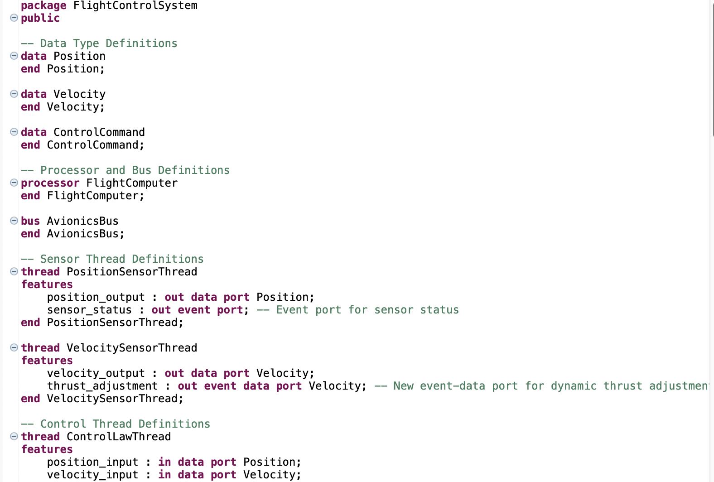
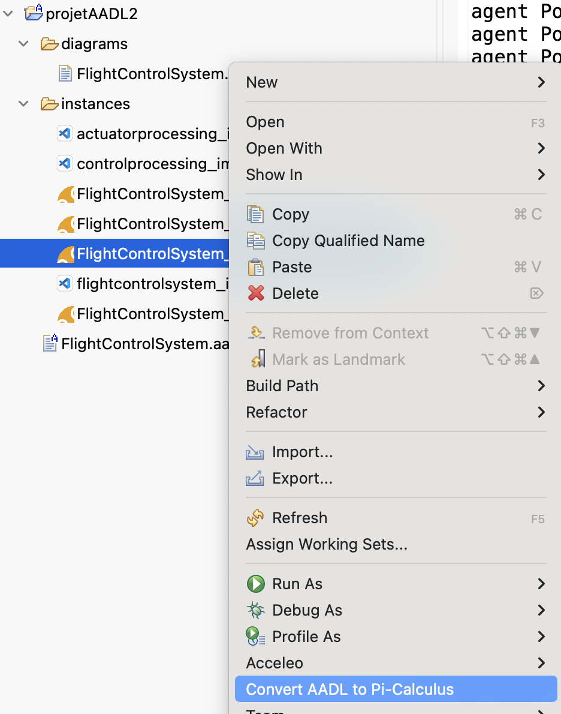
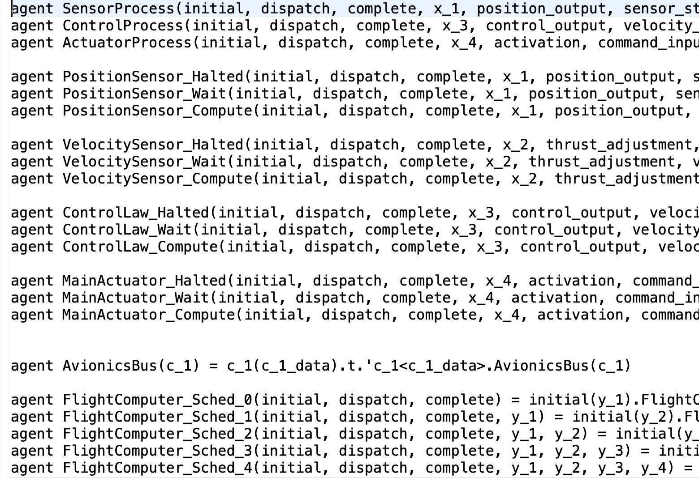

# AADL to $\pi$-Calculus Model Transformation Tool

This repository provides an automated model-driven toolchain to bridge the gap between architectural modeling in **AADL** and formal verification in **$\pi$-Calculus**. The tool automates the mapping rules defined in our approach to facilitate the formal analysis of real-time systems.

---

## Repository Structure

* **`plugins/`**: Contains the pre-compiled `.jar` files for immediate deployment into OSATE.
    * `fr.mem4csd.aadl2picalculus.acceleo.pi.jar` (Core Transformation Logic)
    * `fr.mem4csd.aadl2picalculus.ui.jar` (UI/Menu integration)
* **`src/`**: Contains the Eclipse/OSATE projects for developers to import and build:
    * `fr.mem4csd.aadl2picalculus.acceleo.pi`: Core Acceleo transformation project (.mtl templates).
    * `fr.mem4csd.aadl2picalculus.ui`: UI integration for the OSATE context menu.
* **`sampleAADLProjects/`**: A set of sample AADL projects (including `.aadl` and `.aaxl2` files) used for benchmarking and validation.

---

## Project Workflow: From AADL to π‑Calculus Verification

The verification workflow consists of three main stages: (1) modeling the system architecture in AADL using OSATE, (2) automatically translating the AADL model to π‑calculus using a custom plugin, and (3) verifying temporal properties using the Mobility Workbench (MWB).

---

### Stage 1: AADL Modeling in OSATE

The system architecture is first modeled using the Architecture Analysis and Design Language (AADL) within the OSATE (Open Source AADL Tool Environment) platform. The model captures:

- **Threads** – Periodic tasks with timing properties (period, deadline, WCET).
- **Ports** – Data ports for regular sensor streams, event ports for status signals, and event‑data ports for urgent adjustments.
- **Processors and Buses** – Execution resources and communication channels.
- **Bindings** – Mapping of software components to hardware resources.

**Screenshot: AADL Model in OSATE**



The example above shows the `FlightControlSystem` package with sensor threads (`PositionSensorThread`, `VelocitySensorThread`), a control law thread (`ControlLawThread`), and their associated ports.

---

### Stage 2: Automatic Translation to π‑Calculus

A custom OSATE plugin (`Convert AADL to Pi‑Calculus`) automatically translates the AADL model into a π‑calculus specification. The translation maps:

| AADL Concept | π‑Calculus Equivalent |
|--------------|----------------------|
| Periodic thread | Agent with `Halted → Wait → Compute` states |
| Data port | Channel name (e.g., `position_output`) |
| Event port | Channel without data (e.g., `sensor_status`) |
| Processor | Scheduler agent (`FlightComputer_Sched_0`) |
| Bus | Bus agent (e.g., `AvionicsBus`) |
| Dispatch protocol | `'initial`, `'dispatch`, `'complete` handshake |

**Screenshot: Plugin Trigger in OSATE**



Right‑clicking on the AADL system implementation invokes the translation plugin, which generates a `.pi` file containing the π‑calculus agents.

**Screenshot: Generated π‑Calculus Code**



The generated code includes agents for each thread (e.g., `PositionSensor_Halted`, `ControlLaw_Compute`), the scheduler (`FlightComputer_Sched_0`), and the avionics bus (`AvionicsBus`).

---

### Stage 3: Temporal Logic Verification in MWB

The generated π‑calculus file is loaded into the Mobility Workbench (MWB), where modal μ‑calculus formulas are used to verify:

- **Deadlock freedom** – The system never reaches a state with no outgoing transitions.
- **Safety** – No unexpected `error` labels occur.
- **Liveness** – Tasks eventually complete and messages are delivered.
- **Schedulability** – Tasks meet their bounded execution time.
- Other Functional Properties Specific to the Model.

Example MWB check for global deadlock freedom:

```mwb
check FlightControlSystemImplInstance nu X. (<true> TT & [true] X)
```
The verification results confirm that the translated model preserves the intended concurrency and communication semantics of the original AADL specification.

### Workflow Summary Diagram:

```text
┌─────────────────┐     ┌──────────────────┐     ┌────────────────────┐
│   AADL Model    │ ──► │  π‑Calculus Code │ ──► │  MWB Verification  │
│   (OSATE)       │     │  (Generated .pi) │     │  (Yes/No + Trace)  │
└─────────────────┘     └──────────────────┘     └────────────────────┘
        │                         │                        │
        ▼                         ▼                        ▼
  System architecture      Formal process model      Temporal properties
  Threads, ports, buses    Agents, channels          Deadlock, liveness
```

This workflow enables rigorous formal verification of real‑time embedded architectures by bridging the gap between industrial modeling standards (AADL) and process algebraic verification tools (π‑calculus + MWB).

## Installation & Usage

### For End Users (Immediate Use)
If you simply want to perform transformations within OSATE, you do not need to build the source code.

1.  Navigate to the `plugins/` folder in this repository.
2.  Download the JAR files.
3.  Copy these files into the `plugins/` directory of your **OSATE installation**.
4.  Restart OSATE with the `-clean` flag to refresh the configuration.
5.  **Right-click** any **AADL Instance file (`.aaxl2`)** and select **"Convert AADL to Pi-Calculus"**.

### For Developers (Building from Source)
To explore or modify the mapping rules:

1.  **Import Projects**: Import all projects from the `src/` folder into your OSATE workspace.
2.  **Prerequisites**: Ensure you have the **Acceleo** engine installed in your environment.
3.  **Edit Mapping**: Open `generate.mtl` in the `fr.mem4csd.aadl2picalculus.acceleo.pi` project to edit the transformation rules.
4.  **Re-build the Logic**: After changing the `.mtl` file, you must update the plugin:
5.  **Sync Distribution**: To make your changes available to others, you must update the repository's top-level **`plugins/`** folder:
    * Export the `fr.mem4csd.aadl2picalculus.acceleo.pi` projects as **Deployable Plug-ins**.
    * Copy the newly generated JAR into the repository's **`plugins/`** folder.
6.  **Test**: Launch a **Runtime Instance** of Eclipse to test your changes live.

---

## Validation with Benchmarks

The `sampleAADLProjects/` folder includes a variety of AADL models that represent common embedded real‑time architectural patterns. These models serve as benchmarks to ensure that the generated π‑calculus specifications accurately capture the concurrency, communication, and scheduling semantics of the source architecture. Each model is systematically verified using temporal logic (modal μ‑calculus) in the Mobility Workbench, checking for deadlock freedom, safety, liveness, and schedulability properties.

---

## 1. RMA Model – Rate‑Monotonic Scheduling ([Source](https://github.com/OpenAADL/AADLib/tree/master/examples/rma))

### Model Explanation

This model captures a two‑task Rate‑Monotonic Scheduling (RMA) system executing on a single processor. Task1 has a period of 1000 ms and lower priority; Task2 has a period of 500 ms and higher priority. Both tasks autonomously release a single job at initialization, wait for dispatch from a centralized FIFO scheduler, execute for one discrete time tick (`t`), and signal completion. The scheduler maintains a bounded queue of length two. The model represents one hyperperiod—after both tasks execute once, the system reaches a quiescent termination state.

### AADL Code

```aadl
--  This AADL model illustrates how to conduct schedulability analysis
--  using Cheddar, and then code generation of periodic tasks.
--
--  Two periodic tasks run in parallel, without interaction. Tasks
--  parameters allows RMA analysis

package RMAAadl
public
  with Processors;

  -----------------
  -- Subprograms --
  -----------------

  subprogram Hello_Spg_1
  properties
    source_language => (C);
    source_name     => "user_hello_spg_1";
    source_text     => ("hello.c");
  end Hello_Spg_1;

  subprogram Hello_Spg_2
  properties
    source_language => (C);
    source_name     => "user_hello_spg_2";
    source_text     => ("hello.c");
  end Hello_Spg_2;

  -------------
  -- Threads --
  -------------

  thread Task
  end Task;

  thread implementation Task.impl_1
  calls
    Mycalls: {
    P_Spg : subprogram Hello_Spg_1;
    };
  properties
    Dispatch_Protocol                  => Periodic;
    Priority                           => 1;
    Period                             => 1000 ms;
    Compute_Execution_time             => 0 ms .. 3 ms;
    Deadline                           => 1000 ms;
  end Task.impl_1;

  thread implementation Task.impl_2
  calls
    Mycalls: {
    P_Spg : subprogram Hello_Spg_2;
    };
  properties
    Dispatch_Protocol                  => Periodic;
    Priority                           => 2;
    Period                             => 500 ms;
    Compute_Execution_time             => 0 ms .. 5 ms;
    Deadline                           => 500 ms;
  end Task.impl_2;

  ---------------
  -- Processor --
  ---------------

  processor cpu extends processors::cpu_rma
  end cpu;

  processor implementation cpu.impl extends processors::cpu_rma.impl
  properties
    Scheduling_Protocol => (POSIX_1003_HIGHEST_PRIORITY_FIRST_PROTOCOL);
  end cpu.impl;

  ---------------
  -- Processes --
  ---------------

  process node_a
  end node_a;

  process implementation node_a.impl
  subcomponents
    Task1 : thread Task.impl_1;
    Task2 : thread Task.impl_2;
  end node_a.impl;

  ------------
  -- System --
  ------------

  system rma
  end rma;

  system implementation rma.impl
  subcomponents
    node_a : process node_a.impl;
    cpu	   : processor cpu.impl;
  properties
    Actual_Processor_Binding => (reference (cpu)) applies to node_a;

  annex real_specification {**

     theorem check_scheduling
      foreach e in system_set do
      requires(check_scheduling);
      check(1=1);
      end check_scheduling;

      theorem check_wcrt
      foreach s in local_set do
      requires(wcrt);
      check(1=1);
      end check_wcrt;

    **};

  end rma.impl;

end RMAAadl;

```

### Pi Calculus expression

```pi
agent NodeA(initial, dispatch, complete, x_1, x_2) = Task1_Halted(initial, dispatch, complete, x_1) | Task2_Halted(initial, dispatch, complete, x_2)

agent Task1_Halted(initial, dispatch, complete, x_1) = 'initial<x_1>.Task1_Wait(initial, dispatch, complete, x_1)
agent Task1_Wait(initial, dispatch, complete, x_1) = dispatch(d).[d=x_1]Task1_Compute(initial, dispatch, complete, x_1)
agent Task1_Compute(initial, dispatch, complete, x_1) = t.'complete<x_1>.Task1_Wait(initial, dispatch, complete, x_1)

agent Task2_Halted(initial, dispatch, complete, x_2) = 'initial<x_2>.Task2_Wait(initial, dispatch, complete, x_2)
agent Task2_Wait(initial, dispatch, complete, x_2) = dispatch(d).[d=x_2]Task2_Compute(initial, dispatch, complete, x_2)
agent Task2_Compute(initial, dispatch, complete, x_2) = t.'complete<x_2>.Task2_Wait(initial, dispatch, complete, x_2)

agent Cpu_Sched_0(initial, dispatch, complete) = initial(y_1).Cpu_Sched_1(initial, dispatch, complete, y_1) 
agent Cpu_Sched_1(initial, dispatch, complete, y_1) = initial(y_2).Cpu_Sched_2(initial, dispatch, complete, y_1, y_2) + 'dispatch<y_1>.complete(y_1).Cpu_Sched_0(initial, dispatch, complete)
agent Cpu_Sched_2(initial, dispatch, complete, y_1, y_2) = 'dispatch<y_1>.complete(y_1).Cpu_Sched_1(initial, dispatch, complete, y_2)

agent RmaImplInstance = (^initial, dispatch, complete, x_1, x_2) (NodeA(initial, dispatch, complete, x_1, x_2) | Cpu_Sched_0(initial, dispatch, complete))
```

### Temporal Logic Properties (MWB)

```mwb
-- Global deadlock freedom
check RmaImplInstance nu X. (<true> TT & [true] X)

-- Individual component deadlocks
deadlocks Task1_Halted<initial,dispatch,complete,x_1>
deadlocks Task2_Halted<initial,dispatch,complete,x_2>
deadlocks Cpu_Sched_0<initial,dispatch,complete>

-- Safety (no error labels)
check Task1_Compute<initial,dispatch,complete,x_1> nu X. ([error] FF & [t] X & [dispatch] X)
check Task2_Compute<initial,dispatch,complete,x_2> nu X. ([error] FF & [t] X & [dispatch] X)
check Cpu_Sched_0<initial,dispatch,complete> nu X. (['dispatch] FF & [initial] X & [t] X)

-- Liveness (tasks eventually complete)
check Task1_Compute<initial,dispatch,complete,x_1> mu X. (<'complete> TT | <t> X)
check Task2_Compute<initial,dispatch,complete,x_2> mu X. (<'complete> TT | <t> X)

-- Scheduler progress
check Cpu_Sched_1<initial,dispatch,complete,y_1> mu X. (<'dispatch> TT | <initial> X)
check Cpu_Sched_2<initial,dispatch,complete,y_1,y_2> mu X. (<'dispatch> TT | <initial> X)

-- Bounded response (deadline meet)
check Task1_Compute<initial,dispatch,complete,x_1> <t> (<'complete> TT)
check Task2_Compute<initial,dispatch,complete,x_2> <t> (<'complete> TT)

-- Periodic readiness
check Task1_Compute<initial,dispatch,complete,x_1> <'complete<x_1>> (<initial> TT)
check Task2_Compute<initial,dispatch,complete,x_2> <'complete<x_2>> (<initial> TT)

-- Global liveness
check RmaImplInstance mu X. (<t> TT | <tau> TT)
```

